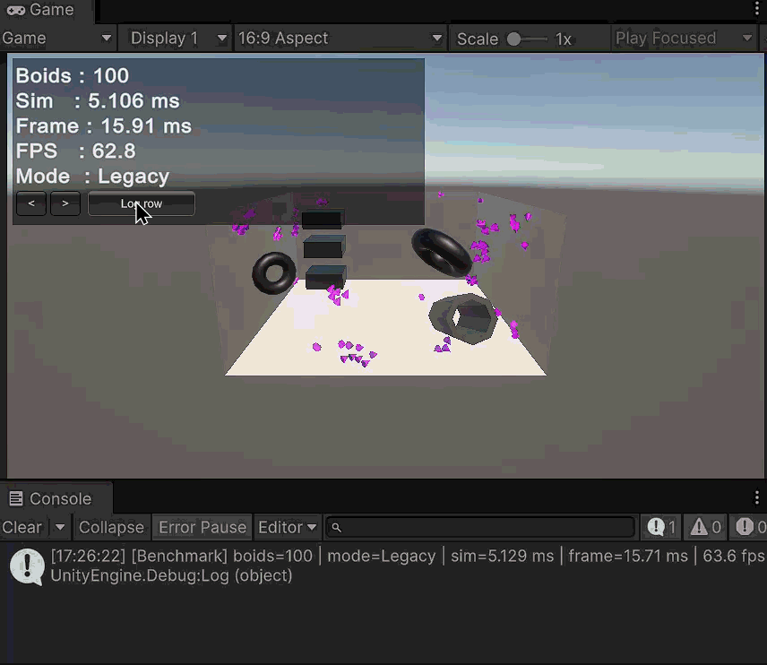

# 🐟 Boids 기반 군집 행동 시뮬레이션과 최적화

이번 스터디는 Boids 알고리즘을 기반으로 다수의 개체가 자연스럽게 군집 행동을 하도록 구현하는 것을 목표로 합니다.

Boids는 각각의 개체가 복잡한 AI를 갖는 것이 아니라, 주변 개체를 기준으로 단순한 규칙을 따르도록 하여 자연스러운 군집 행동을 만들어내는 알고리즘입니다.

기본 Boids 구현부터 시작해, 게임 월드 적용, 공간 분할 최적화, 최종 데모 제작까지 진행합니다.

<!-- 📺 **전체 플레이리스트** → [Boids Dev Log — Unity](링크) -->

---

## 🛠️ Tech Stack

- **Engine:** Unity 6 (URP)
- **Language:** C#
- **Mesh:** ProBuilder

---

## 🧠 Boids 핵심 개념

### 1. Separation (분리)


- 너무 가까운 이웃과는 멀어지는 규칙
- 개체끼리 서로 겹치거나 뭉치는 것을 방지
- 예시: 가까운 Boid가 있다면 반대 방향으로 이동한다

### 2. Alignment (조정)


- 주변 이웃들의 평균 이동 방향에 맞추는 규칙
- 군집이 전체적으로 비슷한 방향으로 흐르도록 만든다
- 예시: 주변 Boid들이 오른쪽으로 이동하고 있다면, 나도 오른쪽 방향으로 조금 맞춘다

### 3. Cohesion (응집)


- 주변 이웃들의 평균 위치, 즉 군집 중심 쪽으로 이동하는 규칙
- 개체들이 너무 흩어지지 않고 하나의 무리를 유지하도록 만든다
- 예시: 주변 Boid들의 중심점을 향해 이동한다

---

## ⚙️ 구현 과정

### 1. 🐦 Boids 기본 알고리즘 구현

> CPU에서 Separation, Alignment, Cohesion 세 가지 규칙을 이용해 기본적인 군집 움직임을 구현합니다.

<!-- > ▶ [Week 1](링크) -->


#### BoidData & BoidSettings

각 Boid의 상태는 `BoidData` struct로 관리합니다. 매 프레임 모든 Boid의 배열을 순회할 때 불필요한 컴포넌트 참조 없이 위치와 방향만 전달할 수 있도록 가볍게 유지합니다.

```csharp
public struct BoidData
{
    public Vector3 position;
    public Vector3 direction;
}
```

군집 행동에 필요한 파라미터는 `BoidSettings`에 모아 `BoidsManager`에서 중앙 관리합니다.

#### Separation / Alignment / Cohesion

세 규칙 모두 `perceptionRadius`(또는 `separationRadius`) 안의 이웃 Boid를 순회해 평균값을 구한 뒤, `SteerTowards`로 조향력을 계산합니다.

**🔴 Separation** — 너무 가까운 이웃을 밀어냄. 거리에 반비례해 가중치를 높여 가까울수록 강하게 반응합니다.

```csharp
foreach (var boid in allBoids)
{
    float dist = Vector3.Distance(transform.position, boid.position);
    if (dist > 0f && dist < s.separationRadius)
    {
        avgAvoid += (transform.position - boid.position).normalized / dist;
        count++;
    }
}
```

**🟡 Alignment** — 이웃들의 평균 방향으로 맞춤.

```csharp
foreach (var boid in allBoids)
{
    float dist = Vector3.Distance(transform.position, boid.position);
    if (dist > 0f && dist < s.perceptionRadius)
    {
        avgDir += boid.direction;
        count++;
    }
}
```

**🟢 Cohesion** — 이웃들의 평균 위치(중심점)를 향해 이동.

```csharp
foreach (var boid in allBoids)
{
    float dist = Vector3.Distance(transform.position, boid.position);
    if (dist > 0f && dist < s.perceptionRadius)
    {
        avgPosition += boid.position;
        count++;
    }
}
return SteerTowards(avgPosition - transform.position, s);
```

세 힘은 각각의 weight를 곱해 합산되고, `SteerTowards`를 통해 `maxSteerForce`로 클램핑된 조향 벡터로 변환됩니다.

```csharp
Vector3 acceleration = Separation(allBoids, s) * s.separationWeight
                     + Alignment(allBoids, s)  * s.alignmentWeight
                     + Cohesion(allBoids, s)   * s.cohesionWeight;
```

```csharp
// Reynolds steering: 목표 방향의 최대 속도 벡터에서 현재 속도를 뺀 값
Vector3 steer = desired.normalized * maxSpeed - velocity;
return Vector3.ClampMagnitude(steer, maxSteerForce);
```

> **⚠️ 현재 시간복잡도: O(N²)**  
> 매 프레임 모든 Boid가 나머지 모든 Boid를 순회하기 때문에, 개체 수가 늘어날수록 연산량이 제곱으로 증가합니다.  
> **3주차에서 Spatial Hash 또는 Uniform Grid를 도입해 주변 탐색 범위를 제한하고 O(N) 수준으로 개선할 예정입니다.**

---

### 2. 🧱 장애물 회피 (Obstacle Avoidance)

> 단순히 떠다니는 군집이 아니라, 게임 월드 안에서 장애물을 스스로 피하며 움직이는 군집으로 확장합니다.

<!-- > ▶ [Week 2](링크) -->


#### BoidHelper — 황금비 나선 구면 샘플링

장애물 회피의 핵심은 "막히지 않은 방향"을 빠르게 찾는 것입니다. 이를 위해 `BoidHelper`는 구면 위에 300개의 방향 벡터를 미리 계산해 static으로 보관합니다.

방향 벡터를 생성할 때 **인덱스 순서**가 핵심입니다. `t = i / N`으로 inclination이 0 → π로 선형 증가하기 때문에, 인덱스 0번은 정면(forward), 뒤로 갈수록 옆·뒤쪽 방향으로 퍼집니다. 여기에 **황금비(φ ≈ 1.618)** 를 azimuth 증분으로 사용합니다. 황금비는 어떤 분수로도 정확히 근사되지 않는 특성 때문에 나선이 절대 겹치거나 한쪽에 몰리지 않고, 각 인덱스 구간에서 구면 위의 방향이 고르게 분포됩니다.

이 두 특성이 결합된 결과, `ObstacleRays`에서 인덱스 0번부터 순회하면 **균등하게 퍼진 방향들을 정면에서부터 차례로 탐색**하게 됩니다. 별도의 정렬이나 거리 비교 없이 단순 순회만으로, 첫 번째로 발견한 통과 방향이 자연스럽게 현재 진행 방향과 가장 가까운 열린 방향이 됩니다.

```csharp
float goldenRatio = (1 + Mathf.Sqrt(5)) / 2;
float angleIncrement = Mathf.PI * 2 * goldenRatio;

for (int i = 0; i < numViewDirections; i++)
{
    float t = (float)i / numViewDirections;
    float inclination = Mathf.Acos(1 - 2 * t);
    float azimuth = angleIncrement * i;

    float x = Mathf.Sin(inclination) * Mathf.Cos(azimuth);
    float y = Mathf.Sin(inclination) * Mathf.Sin(azimuth);
    float z = Mathf.Cos(inclination);
    directions[i] = new Vector3(x, y, z);
}
```

인덱스 순서대로 forward(정면)에서 시작해 점점 옆과 뒤쪽으로 퍼져나가는 구조입니다. 이 순서가 이후 장애물 회피에서 핵심 역할을 합니다.

#### 장애물 감지 — IsHeadingForCollision

매 프레임 현재 진행 방향(forward)으로 `SphereCast`를 쏩니다. `collisionAvoidanceDistance` 안에 장애물이 감지되면 회피 로직을 시작합니다.

```csharp
Physics.SphereCast(transform.position, s.collisionRadius, transform.forward,
    out hit, s.collisionAvoidanceDistance, s.collisionMask)
```

ray가 아닌 sphere를 쓰는 이유는 Boid 자체의 부피를 고려해야 하기 때문입니다. `collisionRadius`는 Boid의 실제 크기에 맞게 설정합니다.

#### 대체 방향 탐색 — ObstacleRays

장애물이 감지되면 `BoidHelper.directions`의 300개 방향을 인덱스 0번부터 순서대로 순회합니다. 각 방향으로 동일한 `SphereCast`를 쏘고, **막히지 않는 첫 번째 방향을 즉시 반환**합니다.

```csharp
for (int i = 0; i < dirs.Length; i++)
{
    Vector3 dir = transform.TransformDirection(dirs[i]);
    Ray ray = new Ray(transform.position, dir);
    if (!Physics.SphereCast(ray, s.collisionRadius, s.collisionAvoidanceDistance, s.collisionMask))
        return dir;
}
```

황금비 나선 순서 덕분에 정면에 가까운 방향부터 탐색하게 되고, 결과적으로 **현재 진행 방향을 최소한으로 바꾸는 경로**를 자연스럽게 선택합니다. 찾은 방향은 `collisionAvoidanceWeight(10f)`가 곱해진 강한 조향력으로 적용되어 다른 flocking 규칙을 압도합니다.

#### 디버그 기즈모 — DrawDebugGizmos

구현 과정을 시각적으로 확인하기 위해 `GizmoType` enum으로 표시 모드를 제어하는 디버그 기즈모를 추가했습니다.

```csharp
public enum GizmoType { Never, SelectedOnly, Always }
```

`SelectedOnly`로 설정하면 Hierarchy에서 선택한 Boid 하나에만 기즈모가 표시됩니다.

| 색상 | 의미 |
|------|------|
| 회색 점 (300개) | `BoidHelper.directions` 구면 위 방향 샘플 |
| 초록 선 | forward SphereCast 통과 — 장애물 없음 |
| 빨간 선 | forward SphereCast 감지 — 회피 로직 활성화 |
| 반투명 짧은 빨간 선 | `ObstacleRays`에서 막힌 방향 |
| 하얀 선 | `ObstacleRays`에서 찾은 첫 번째 통과 방향 (실제 조향 목표) |


---

### 3. ⚡ 성능 최적화 — O(N²)에서 멀티코어·GPU까지

> 1주차에서 남긴 **O(N²) 문제**를 단계별로 해결합니다.
> **알고리즘 → 자료구조 → 병렬화 → 렌더링** 순서로 점진적으로 개선하며,
> 각 단계의 효과를 **측정**합니다.

<!-- > ▶ [Week 3](링크) -->

#### 📐 측정 환경

아래 모든 수치는 동일한 조건에서 측정했습니다.

| 항목 | 값 |
|------|-----|
| Boid 수 | 100 / 300 / 1000 / 3,000 (구간별 비교) |
| CPU / 빌드 | Intel Core i7-13700KF / Dev |
| 측정 지표 | `sim ms` — 인지+조향 루프만 계측 (렌더·vsync 분리), `fps` |
| 프레임 평활 | EWMA α=0.1 (프레임 간 튐 완화) |

> `sim ms`는 `Stopwatch`로 **시뮬레이션 루프만** 따로 잽니다. 렌더링·vsync가 섞이면 알고리즘 개선 효과가 가려지기 때문에, 순수 연산 시간만 분리해 측정합니다.

#### 🪜 최적화 단계 요약

| Step | 제목 | 핵심 기법 | 복잡도 |
|------|------|-----------|--------|
| **0** | 📏 벤치마크 하니스 | Stopwatch + HUD 계측 | — |
| **1·2** | 🧮 알고리즘 개선 | 단일 패스 + sqrMagnitude | O(3N²) → O(N²) |
| **3** | 🗂️ 공간 분할 | Spatial Hash Grid (27셀) | O(N·k) |
| **4** | 🧵 병렬화 | Unity Jobs + Burst | O(N·k) ÷ 코어 |
| **5** | 🎨 렌더링 | GPU Instancing | Drawcall N → ⌈N/1023⌉ |

---

#### Step 0 — 📏 측정 준비 · Stopwatch + HUD

> 렌더·vsync와 분리해 **시뮬레이션 루프만** 계측합니다.

**문제** — 개선 효과를 숫자로 확인할 수단이 먼저 필요합니다.

**해결** — 시뮬레이션 루프(인지+조향)만 `Stopwatch`로 감싸 `sim ms`로 측정하고, EWMA로 평활해 HUD에 실시간 표시합니다. 렌더링·vsync와 분리했기 때문에 알고리즘 개선이 그대로 숫자에 반영됩니다.

```csharp
_simWatch.Restart();
// ... 인지 계산 + 조향 업데이트 ...
_simWatch.Stop();

// ms 변환 후 지수이동평균(α=0.1)으로 튐 완화
float ms = (float)_simWatch.Elapsed.TotalMilliseconds;
SimMs = Mathf.Lerp(SimMs, ms, 0.1f);
```

같은 씬에서 `PerceptionMode` enum을 토글하며 각 방식을 비교할 수 있게 했습니다.



---

#### Step 1·2 — 🧮 알고리즘 개선 · 단일 패스 + sqrMagnitude

> O(3N²) → **O(N²)**

**문제** — 기존 구현은 Separation·Alignment·Cohesion 세 규칙이 **각각** 전체 Boid를 순회합니다. 같은 이웃을 3번 검사하는 셈이고, 거리 계산마다 `Vector3.Distance`(내부 `sqrt`)를 호출합니다.

**해결** — 한 번의 순회로 세 규칙에 필요한 값을 `PerceptionResult`에 동시 누산하고(3패스→1패스), 거리 비교는 제곱 거리(`sqrMagnitude`)로 바꿔 `sqrt`를 제거합니다.

```csharp
// 이웃 하나를 SAC 누산값에 1패스로 반영
Vector3 offset = posI - other.position;
float sqr = offset.sqrMagnitude;            // sqrt 없이 제곱거리로 비교
if (sqr <= 0f || sqr >= perceptSqr) return;

p.alignmentSum += other.direction;          // Alignment
p.cohesionSum  += other.position;           // Cohesion
p.flockCount++;

if (sqr < sepSqr)
{
    p.separationSum += offset / sqr;        // normalized/dist == offset/sqr → sqrt 불필요
    p.separationCount++;
}
```

> `offset.normalized / dist` 는 수학적으로 `offset / sqr` 와 같습니다. 분리 가중치(거리 반비례)를 유지하면서 `sqrt`를 완전히 없앤 부분이 포인트입니다.

또한 **인지 계산을 `BoidsManager`로 모으고**, 각 `Boid`는 결과를 받아 조향만 하도록 책임을 분리했습니다. 이 구조가 이후 Jobs 병렬화의 토대가 됩니다.

<!-- 🎬 [GIF] 같은 boid 수에서 Legacy vs SinglePass sim ms 비교 (HUD 보이게) -->

---

#### Step 3 — 🗂️ 공간 분할 · Spatial Hash Grid

> O(N²) → **O(N·k)** (k = 셀당 평균 이웃 수)

**문제** — 1패스로 줄여도 시간 복잡도는 여전히 O(N²)입니다.
검사할 필요가 없는 멀리 떨어진 Boid까지 매번 전부 순회합니다.

**해결** — 공간을 `perceptionRadius` 크기의 셀로 나누는 **Spatial Hash Grid**를 도입합니다. 셀 크기를 인지 반경과 같게 잡으면 반경 내 이웃은 반드시 **자기 셀 + 인접 26셀(3×3×3)** 안에 있습니다. 매 프레임 그리드를 재구성한 뒤, 각 Boid는 주변 27셀만 검사합니다.

```csharp
_grid.Rebuild(_boidData);                    // O(N): 각 Boid를 셀에 해시

foreach (int j in _grid.Neighbors(posI))     // 주변 27셀 후보만 순회
{
    if (i == j) continue;
    Accumulate(ref p, posI, _boidData[j], perceptSqr, sepSqr);
}
```

무한 공간을 다루기 위해 고정 배열이 아닌 `Dictionary<long, List<int>>` 해시 방식을 쓰고, 셀 좌표는 축당 21비트로 인코딩해 하나의 `long` 키로 묶습니다. 리스트는 매 프레임 `Clear`만 하고 재사용해 GC 압력을 줄였습니다.

평균 복잡도는 **O(N·k)** (k = 셀당 평균 이웃 수)로, 개체 수가 늘어도 거의 선형으로 확장됩니다. `drawGridGizmos`로 점유 셀을 시각화해 동작을 눈으로 확인할 수 있습니다.


---

#### 📊 중간 결과 — O(N²)의 폭발

> O(N²) 알고리즘은 개체 수가 늘어날수록 연산량이 **제곱**으로 증가합니다. 100마리에서는 어느정도 프레임을 지킬 수 있지만, 300마리가 되면 연산량이 이론상 9배로 뜁니다. 이에 비해 Grid(O(N·k))는 개체 수가 늘어도 연산량은 거의 선형으로 유지됩니다.

**표 1 — 이론 연산량 배수**

| 개체 수 | 개체 배수 | O(3N²) Legacy | O(N²) SinglePass | O(N·k) Grid |
|:------:|:--------:|:-------------:|:----------------:|:-----------:|
| 100 | 1× | 1× | 1× | 1× |
| 300 | 3× | **9×** | **9×** | ≈3× |
| 1,000 | 10× | **100×** | **100×** | ≈10× |

> Legacy와 SinglePass는 O(N²)로 구조가 같지만, SinglePass는 상수 계수를 3→1로 줄여 낮은 개체 수에서는 생각보다 효과가 있었습니다. 다만 개체 수가 커질수록 상수 절감의 효과는 희석되고 O(N²) 한계에 부딪힙니다. Grid는 복잡도 자체를 낮추기 때문에 개체 수가 늘수록 격차가 더 벌어집니다.

---

**표 2 — 실측 결과** *(sim ms / fps)*

| 개체 수 | Legacy | SinglePass | Grid |
|:------:|:------:|:----------:|:----:|
| 100 | 5.044 ms / 66 fps | 0.694 ms / 95 fps | 0.582 ms / 97 fps |
| 300 | **🔴 43.048 ms / 18 fps** | 4.332 ms / 65 fps | 2.272 ms / 73 fps |
| 1,000 | **💀 461.867 ms / 2 fps** | 37.246 ms / 19 fps | **✅ 10.309 ms / 43 fps** |

---

#### Step 4 — 🧵 병렬화 · Unity Jobs + Burst

> O(N·k) → **O(N·k) ÷ 코어 수**

**문제** — 알고리즘을 O(N·k)까지 줄여도 **단일 스레드**라 CPU 코어 하나만 씁니다. 나머지 코어는 놀고 있습니다.

**해결** — 인지 계산을 `IJobParallelFor`로 쪼개 멀티코어에 분산합니다. 각 워커는 입력을 읽기만 하고 자기 인덱스 결과에만 쓰므로 경쟁(race)이 없습니다. 여기에 단계적으로 가속을 누적합니다.

- **4a — Jobs (병렬만)**: O(N²) 연산을 코어 수만큼 분산
- **4b — Jobs + Burst**: `[BurstCompile]`로 C#을 네이티브/SIMD 코드로 컴파일
- **4c — Jobs + Burst + Grid**: 네이티브 그리드(`NativeParallelMultiHashMap`)로 27셀만 검사하는 병렬 버전 (**종합 최고 성능**)

```csharp
[BurstCompile]
public struct PerceptionGridJob : IJobParallelFor
{
    [ReadOnly] public NativeArray<BoidData> boids;
    [ReadOnly] public NativeParallelMultiHashMap<int, int> grid;
    public NativeArray<PerceptionResult> results;

    public void Execute(int i)
    {
        // 주변 27셀의 후보만 해시로 꺼내 검사 (O(N·k) × 멀티코어 × Burst)
        ...
    }
}
```

```csharp
job.Schedule(_boidData.Length, 32).Complete();   // batch=32: 워커가 한 번에 가져갈 인덱스 묶음
```

> 그리드 해시는 충돌이 나도 "엉뚱한 후보가 섞일" 뿐이고, 거리 검사(`sqr < perceptSqr`)가 걸러내므로 **결과는 항상 정확**합니다(성능만 미세 손해).

`NativeArray`는 `Allocator.Persistent`로 한 번 할당해 매 프레임 재사용하고, `OnDestroy`에서 `Dispose`해 누수를 막습니다.

---

#### Step 5 — 🎨 렌더링 · GPU Instancing

> Drawcall N → **⌈N/1023⌉**

**문제** — 여기까지는 전부 **시뮬레이션(`sim ms`)** 최적화입니다. 하지만 3,000마리를 각자 그리면 **Drawcall이 3,000번** 발생해 CPU 렌더 오버헤드가 fps를 잡아먹습니다.

**해결** — 같은 메시·머티리얼을 `Graphics.RenderMeshInstanced`로 **1,023개씩 묶어** 한 번에 그립니다. 시뮬용 Transform은 그대로 두되 개별 `MeshRenderer`는 끄고(이중 렌더 방지), 행렬만 모아 배치로 넘깁니다.

```csharp
var rp = new RenderParams(_instanceMat);     // enableInstancing 사본
for (int start = 0; start < total; start += MaxPerBatch)   // MaxPerBatch = 1023 (API 상한)
{
    int count = Mathf.Min(MaxPerBatch, total - start);
    for (int k = 0; k < count; k++)
        _batch[k] = _renderTransforms[start + k].localToWorldMatrix;

    Graphics.RenderMeshInstanced(rp, boidMesh, 0, _batch, count);
}
```

결과적으로 **Drawcall이 N → ⌈N/1023⌉** 로 줄어듭니다. 3,000마리도 단 **3번**의 Drawcall로 그려집니다. 인지·조향과 무관한 렌더 단계라 `sim ms`에는 영향이 없고, **fps와 Batches(Stats 창)** 에서 차이가 드러납니다.


---

#### 📊 종합 결과 (3,000마리 기준)

| Step | 방식 | sim ms | vs SinglePass | fps |
|------|------|-------:|--------------:|----:|
| 0 | Legacy (baseline) | **💀 측정불가** | — | <1 |
| 1·2 | SinglePass | 320.041 | 1.0× | 2.9 |
| 3 | Grid | 82.314 | 3.9× | 9.9 |
| 4a | Jobs | 33.983 | 9.4× | 19.8 |
| 4b | Jobs + Burst | **🔑 9.381** | **34.1×** | 38.5 |
| 4c | Jobs + Burst + Grid | 8.914 | 35.9× | 36.9 |
| 5 | 4c + GPU Instancing | _(sim 동일)_ | — | 38.5 |

> **4b에서 압도적인 성능 도약이 발생했다.** Burst 컴파일러가 C#을 네이티브/SIMD 코드로 변환하면서 sim ms가 약 30배나 단축된다. 4c (Grid 결합)는 이론상 추가 개선이 기대되지만 측정 환경에 따라 4b 대비 일관된 차이를 보장하지는 않았다.
>
> **GPU Instancing(Step 5)은 Batches를 3,000→3으로 줄이지만, 이 환경에서 fps 체감 차이는 크지 않았다.** sim이 이미 병목이 아닌 상태(Jobs+Burst)에서는 렌더 오버헤드 절감 효과가 상대적으로 작게 나타난다. Boid 수가 더 많거나 Release 빌드에서 효과가 더 드라마틱하게 나타날 수 있다.
>
> ⚠️ fps 수치는 측정 시점마다 변동이 있으며, 참고값으로만 활용한다. sim ms가 더 신뢰할 수 있는 지표다.

<!-- 📊 [그래프] boid 수(1k/3k/5k) × sim ms 꺾은선 — N² 곡선이 폭발하고 Grid/Jobs가 평탄한 모습 -->

<!-- 🎬 [GIF] 3,000마리 풀군집 데모 (피날레) -->

---

### 4. 🎬 최종 데모 제작과 폴리싱

> 앞서 구현한 Boids 알고리즘, 게임플레이 확장, 최적화 과정을 정리하고 최종 데모를 다듬습니다.  
> 성능 비교, 파라미터 변화, 구현 중 겪은 문제와 해결 방법을 발표 자료 또는 기술 블로그 형태로 공유합니다.

<!-- > ▶ [Week 4](링크) -->

---

## 📅 개발 일지

| 주차 | 핵심 내용 | 영상 |
|------|-----------|------|
| Week 1 | Boids 기본 알고리즘 · Separation · Alignment · Cohesion | <!-- [▶ Week 1](링크) --> |
| Week 2 | 장애물 회피 · 환경 상호작용 · 행동 확장 | <!-- [▶ Week 2](링크) --> |
| Week 3 | 공간 분할 최적화 · GPU Instancing · 렌더링 최적화 | <!-- [▶ Week 3](링크) --> |
| Week 4 | 최종 데모 · 폴리싱 · 발표 | <!-- [▶ Week 4](링크) --> |
