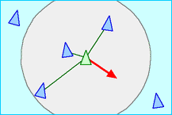
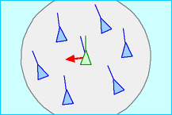
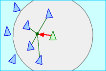

# 🐟 Boids 기반 군집 행동 시뮬레이션과 최적화

이번 스터디는 Boids 알고리즘을 기반으로 다수의 개체가 자연스럽게 군집 행동을 하도록 구현하는 것을 목표로 합니다.

Boids는 각각의 개체가 복잡한 AI를 갖는 것이 아니라, 주변 개체를 기준으로 단순한 규칙을 따르도록 하여 자연스러운 군집 행동을 만들어내는 알고리즘입니다.

기본 Boids 구현부터 시작해, 게임 월드 적용, 공간 분할 최적화, 최종 데모 제작까지 진행합니다.

📺 **전체 플레이리스트** → [Boids Dev Log — Unity](링크)

---

## 🛠️ Tech Stack

- **Engine:** Unity 6 (URP)
- **Language:** C#
- **Mesh:** ProBuilder

---

## 🧠 Boids 핵심 개념

### 1. Separation (분리)

- 너무 가까운 이웃과는 멀어지는 규칙
- 개체끼리 서로 겹치거나 뭉치는 것을 방지
- 예시: 가까운 Boid가 있다면 반대 방향으로 이동한다

### 2. Alignment (조정)

- 주변 이웃들의 평균 이동 방향에 맞추는 규칙
- 군집이 전체적으로 비슷한 방향으로 흐르도록 만든다
- 예시: 주변 Boid들이 오른쪽으로 이동하고 있다면, 나도 오른쪽 방향으로 조금 맞춘다

### 3. Cohesion (응집)

- 주변 이웃들의 평균 위치, 즉 군집 중심 쪽으로 이동하는 규칙
- 개체들이 너무 흩어지지 않고 하나의 무리를 유지하도록 만든다
- 예시: 주변 Boid들의 중심점을 향해 이동한다

---

## ⚙️ 구현 과정

### 1. 🐦 Boids 기본 알고리즘 구현

> CPU에서 Separation, Alignment, Cohesion 세 가지 규칙을 이용해 기본적인 군집 움직임을 구현합니다.

> ▶ [Week 1](링크)

---

### 2. 🧱 환경 상호작용 + 행동 확장

> 단순히 떠다니는 군집이 아니라, 게임 월드 안에서 목적을 가지고 움직이는 군집으로 확장합니다.

> ▶ [Week 2](링크)

---

### 3. ⚡ 공간 분할 최적화 & 렌더링 최적화 _(임시)_

> 모든 Boid가 모든 Boid를 검사하는 O(N²) 방식의 한계를 확인하고, Spatial Hash 또는 Uniform Grid를 이용해 주변 탐색을 최적화합니다.  
> 그 외 GPU Instancing, 오브젝트 풀링, 디버깅 시각화, 파라미터 프리셋 등을 적용해 다수의 Boid가 안정적으로 동작하도록 폴리싱합니다.  
> 전체 Boid 위치/방향을 `ComputeBuffer`에 담아 GPU Compute Shader로 처리합니다.

> ▶ [Week 3](링크)

---

### 4. 🎬 최종 데모 제작과 폴리싱 _(임시)_

> 앞서 구현한 Boids 알고리즘, 게임플레이 확장, 최적화 과정을 정리하고 최종 데모를 다듬습니다.  
> 성능 비교, 파라미터 변화, 구현 중 겪은 문제와 해결 방법을 발표 자료 또는 기술 블로그 형태로 공유합니다.

> ▶ [Week 4](링크)

---

## 📅 개발 일지

| 주차 | 핵심 내용 | 영상 |
|------|-----------|------|
| Week 1 | Boids 기본 알고리즘 · Separation · Alignment · Cohesion | [▶ Week 1](링크) |
| Week 2 | 장애물 회피 · 환경 상호작용 · 행동 확장 | [▶ Week 2](링크) |
| Week 3 | 공간 분할 최적화 · GPU Instancing · 렌더링 최적화 | [▶ Week 3](링크) |
| Week 4 | 최종 데모 · 폴리싱 · 발표 | [▶ Week 4](링크) |
